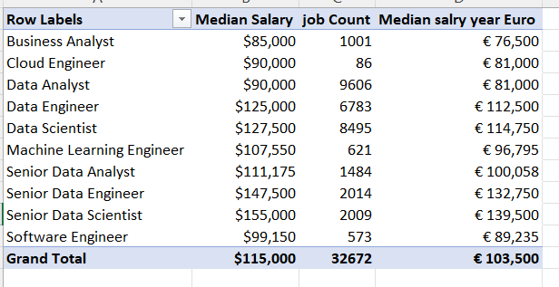
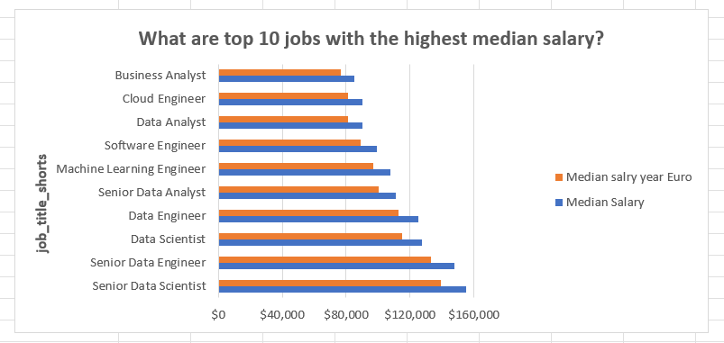
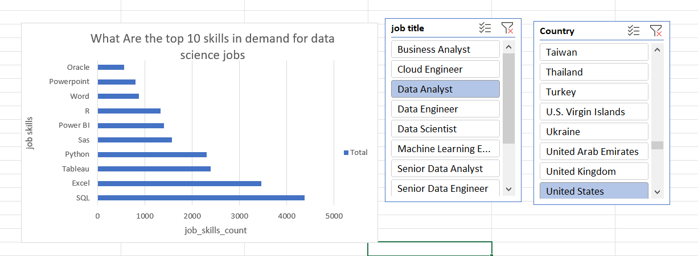

#added to github  

#  Data nerds jobs Salary Analysis 
## Overview/Introduction

This workbook provides an analysis of salaries across various job roles in the data and IT industry. It includes metrics such as median salary, job count, and median salary converted into Euros.
for more information click   [here](/Job_Title_Shorts/Salary_Analyzed.xlsx)  

To analyze and present this data, a combination of **data analytics, visualization, and documentation tools** were used.  
## Here are the main tools used

### **1. Data Collection & Processing**  
- **Microsoft Excel** – Used for data entry, cleaning, and formatting.  
- **Power Query** – Helps in importing and transforming data efficiently.  
- **Power Pivot** – Useful for creating data models and performing advanced calculations.  
 

### **2. Data Analysis & Visualization**  
- **Excel Pivot Tables** – Used to summarize and analyze large datasets quickly.  

### **3. Documentation & Sharing**  

- **GitHub** – Stores and shares data reports, spreadsheets, and documentation.  
-**LinkedIn** _ for sharing my post and projects 

## Data Structure

This workbook [here](/Job_Title_Shorts/Salary_Analyzed.xlsx)  contains the following columns:

- **Row Labels**: containing **Job title**  in the data and IT industry.
- **Median Salary**: The median annual salary in USD for each job title.
- **Job Count**: The number of job postings available for each role.
- **Median Salary (Year in Dollars and Euro)**: The median salary converted to Euros for better international comparison.  

 

|**Job titles**                | **Job Count** | 
|----------------------------|-----------
| Business Analyst          | 3,303      |            
| Cloud Engineer            | 413        | 
| Data Analyst              | 34,591     | 
| Data Engineer             | 47,223     | 
| Data Scientist            | 41,856     | 
| Machine Learning Engineer | 3,281      | 
| Senior Data Analyst       | 6,462      | 
| Senior Data Engineer      | 16,395     | 
| Senior Data Scientist     | 10,569     | 
| Software Engineer         | 3,177      | 
| **Grand Total**           |**167,270**   |  

## Summary of Data

- The dataset includes **10 job titles** with their respective salary statistics.
- The **total number of job postings** across all roles is **32,672**.
- The **overall median salary** is **\$115,000 per year**. With Senior Data scientist with the highest median salary while business Analyst with the least
- The **overall median salary in Euros** is **€103,500 per year**. 
- Data Engineer jobs with the highest job count 

## Further Analysis ##
- I also went further to anlize the data to find are the in demand top skills for Data Science jobs where i narrowed down to data Analytics.  
- Here i found that **SQL** is the top most skill in demand for data analyst while **Oracle** is the list based on the analysis on the top 10 through the use **COUNT()** function   
**Note the analysis is based on the top 10 skills**  
I used **slicers** to help in finding analysis based on your prefference job title to find their related skill sets and demand rate.

## Key Insights

- **Senior Data Scientist** has the highest median salary at **\$155,000 (or €139,500)**.
- **Business Analyst** has the lowest median salary at **\$85,000 (or €76,500)**.
- **Data Analyst** has the highest job count at **9,606**, indicating strong demand.
- The salary conversion to Euros provides an approximate international value based on exchange rates.  
## What i have learnt 
- **Data Analytics Foundations**
Understanding how to analyze data using **Excel Pivot Tables and Power Pivot**.
Working with **data models and Power Query** for efficient data transformation.
Handling large datasets and summarizing insights using **Pivot Tables.**

- **Financial Literacy in IT**
Gaining insights into IT job salaries, skills required, and job market trends.
Learning how to interpret salary data in different currencies (USD & Euro).
Understanding skills per job role and how they relate to the job market.
- **Technical Documentation & GitHub**
Creating README files for data reports and spreadsheets.
Formatting tables for GitHub using Markdown (.md).
Learning how to share data insights in a structured way.
- **Data Visualization & Reporting**
Converting raw data into meaningful tables, summaries, and visual insights.
Using **Excel, Power Pivot** to analyze trends.
Understanding how to communicate findings effectively in a report.
- **Workflow & Collaboration Tools**
Learning about **Google Drive and  GitHub** for documentation.

## How to Use This Workbook

- This workbook is useful for job market analysis, salary benchmarking, and workforce planning.
- HR professionals and job seekers can leverage this data for salary negotiations and market trends.
- Data analysts can extend this dataset by adding more salary insights, filtering by region, or analyzing trends over time.

## Note!!!

- Salary values are approximate and may vary based on location, experience, and industry demand.
- Exchange rate fluctuations can impact the converted Euro salaries.
- **for files that are large that can't be previewed on Github you can download and view locally on your PC.**

For any updates or modifications, please ensure accurate exchange rate adjustments and job market validations.

